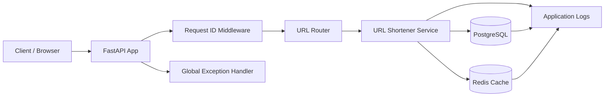
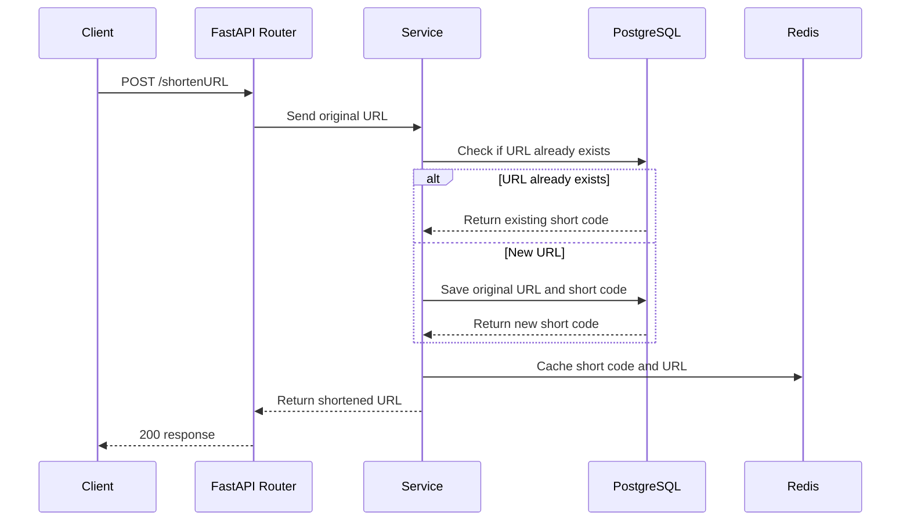
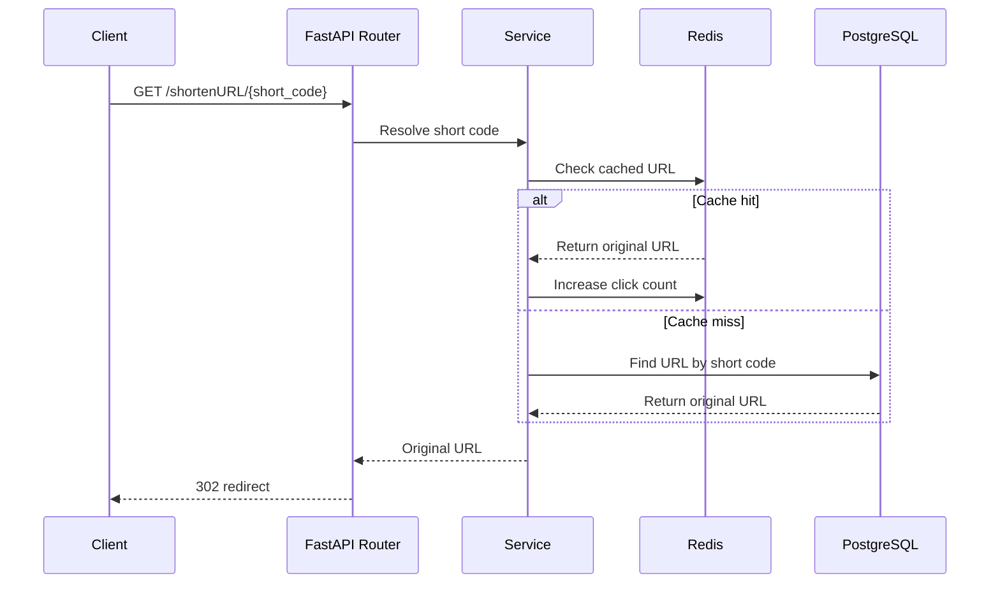
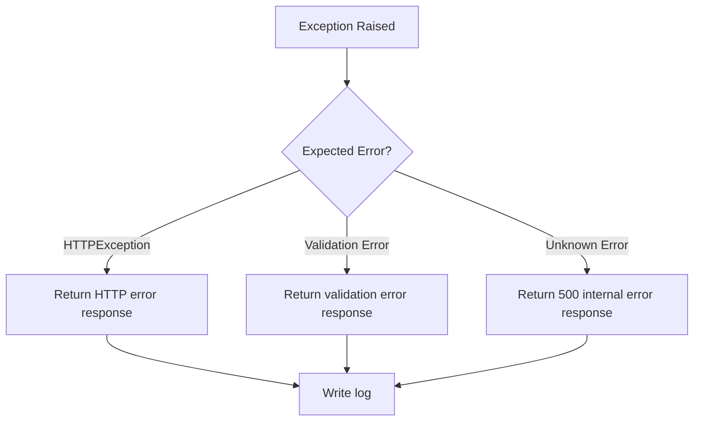

# URL Shortener 🔗

> 🤖 **A quick disclaimer before we dive in:** AI helped shorten this README the same way this app shortens URLs — it just tidied up my rambling into something easier to read. The code, the bugs, and the "wait, why is this not working" moments are all mine. Basically, AI handled the typing cardio 🏃‍♂️ while I handled the actual learning.

A small URL shortener backend that I built as a practice project to understand how real backend services are structured.

The idea is simple: send a long URL, get a short URL, and use that short URL to redirect back to the original website. Long links go in, tiny links come out, and nobody has to stare at a URL that looks like it's trying to tell its life story 📖➡️🔗.

While building this, I focused more on backend design than on just making the API work. I practiced FastAPI routing, service layer design, async PostgreSQL, Redis caching, request logging, global exception handling, Alembic migrations, and a small background scheduler.

I'm sharing this mainly for other folks learning backend development — if you're new to it too, this is a small, low-pressure example of how one API feature slowly grows into multiple backend parts: route, service, database, cache, logs, config, migration, and error handling. Feel free to poke around, copy what's useful, and skip what isn't 🙂.

## Why I Built This 🚀

I wanted to build a project that's small enough to complete, but still has real backend concepts hiding inside it.

A URL shortener looks simple from the outside, but once I started building it, I found a whole system-design buffet hiding inside one small feature 🍽️. It was like clicking a short link and getting redirected straight to backend school.

This project helped me practice:

- separating route logic from service logic 🧩
- writing async database code ⚡
- using Redis as a cache 🏎️
- tracking URL clicks 📊
- adding request-level logs 🪵
- handling exceptions globally 🛡️
- using environment-based configuration ⚙️
- managing database migrations 🗃️

## Features ✨

- Create a short URL from a long URL
- Redirect short URL to original URL
- Store URL mapping in PostgreSQL
- Cache URL mapping in Redis
- Track click count in Redis using sorted sets
- Reuse existing short code for the same URL (no cloning links like it's 2003)
- Add request ID in every request and response
- Log service, database, Redis, and exception flow
- Global exception handler for consistent error response
- Alembic migration for database setup
- Background scheduler for Redis pruning practice
- NumPy-style docstrings in functions

## In Simple Words 🧃

This app does three main things:

- 🐘 **PostgreSQL** — remembers the original long URL forever (the elephant never forgets)
- ⚡ **Redis** — keeps popular short URLs close by, for lookups at lightning speed
- 🚪 **FastAPI** — greets the request, points it in the right direction, and shows it out

PostgreSQL is the permanent memory. Redis is the quick memory. FastAPI is the front desk. The service layer is where the actual thinking happens.

Short version: the URL gets shortened, but the backend learning does not 📚.

## Tech Stack 🛠️

| Area | Tool |
| --- | --- |
| API 🌐 | FastAPI |
| Validation ✅ | Pydantic |
| Database 🐘 | PostgreSQL |
| ORM 🔗 | SQLAlchemy async |
| Cache ⚡ | Redis |
| Migration 🗃️ | Alembic |
| Scheduler ⏰ | APScheduler |
| Local Redis 🐳 | Docker |
| Language 🐍 | Python |

## High Level Architecture 🧠



## Backend Story Time 📖

When someone creates a short URL, the app doesn't just throw a random string at the wall and hope it sticks 🎯.

It goes through a proper flow:

- the router receives the request 📥
- the service layer handles the main logic 🧠
- PostgreSQL stores the real URL 🐘
- Redis stores a faster lookup copy ⚡
- logs keep track of what happened 🪵
- global exception handling catches errors in one place 🛡️

So even though this is a small app, it still follows the idea of keeping responsibilities separate. The router does router things. The service does service things. Redis tries to be fast, because that is literally its whole personality 💨.

## Create Short URL Flow ⚡



## Redirect Flow 🔁



## API Endpoints 📌

### Create Short URL

```http
POST /shortenURL
```

Request body:

```json
{
  "url": "https://example.com/some/long/url"
}
```

Success response:

```json
{
  "statusCode": "20001",
  "data": {
    "shortenedURL": "http://localhost:8000/shortenURL/<short_code>"
  },
  "errorDetails": null
}
```

### Redirect Short URL

```http
GET /shortenURL/{short_code}
```

This returns a `302` redirect to the original URL — off it goes 🚀.

## Project Structure 📁

```text
app/
  main.py                         # FastAPI app setup
  config.py                       # Environment configuration
  database.py                     # Async database setup
  redis_connector.py              # Redis connection setup
  global_exception_handler.py     # Global exception handlers
  middleware/
    request_middleware.py         # Request ID middleware
  routers/
    shorten_url_routers.py        # API routes
  services/
    url_shortener_service.py      # Business logic
  mixins/
    database_operations.py        # Database operations
    redis_operations.py           # Redis operations
  models/
    urls.py                       # SQLAlchemy model
  schemas/
    urls_request_schemas.py       # Request schema
    urls_response_schemas.py      # Response schema
  schedulers/
    redis_prune_schedule.py       # Redis prune scheduler task
alembic/
  versions/                       # Database migrations
```

## Local Setup 💻

Create and activate a virtual environment:

```powershell
python -m venv ..\.venv
..\.venv\Scripts\activate
```

Install dependencies:

```powershell
pip install -r requirements.txt
```

Run Redis locally with Docker:

```powershell
docker run -d --name redis -p 6379:6379 redis
```

Add local environment variables in `.env`:

```env
DB_USERNAME = "postgres"
DB_PASSWORD = "admin"
DB_HOSTNAME = "localhost"
DB_PORT_NUMBER = "5432"
DB_DATABASE_NAME = "postgres"
POOL_SIZE = "10"
MAX_OVERFLOW_POOL = "5"
DB_POOL_TIMEOUT = "15"
DB_POOL_RECYCLE_TIME = "1800"

REDIS_HOST_NAME = "localhost"
REDIS_USER_NAME = ""
REDIS_PASS_WORD = ""
REDIS_SSL_ENABLED = "false"
REDIS_SSL_CERTFILE = ""
REDIS_SSL_KEYFILE = ""
REDIS_SSL_CA_CERTS = ""
REDIS_POOL_SIZE = "10"
REDIS_URL_TRACK_KEY = "global:site_clicks"
REDIS_URL_CLICK_TRACK_KEY = "global:site_track"
REDIS_TOP_MAX_URL_CAPACITY = "10000"
REDIS_UNPOPULAR_URL_PRUNE_TASK_TIME_IN_SECONDS = "3600"
```

Run database migration:

```powershell
alembic upgrade head
```

Start the API:

```powershell
uvicorn app.main:app --reload
```

Open Swagger docs:

```text
http://localhost:8000/docs
```

## Redis Commands I Used 🧪

Check Redis is alive:

```powershell
docker exec -it redis redis-cli ping
```

Expected output:

```text
PONG
```

Check cached URL mappings:

```powershell
docker exec -it redis redis-cli HGETALL global:site_clicks
```

Check URL click tracking:

```powershell
docker exec -it redis redis-cli ZRANGE global:site_track 0 -1 WITHSCORES
```

Redis may look empty at first if no API call has written anything yet. It's not being lazy 😴, it's just waiting for work.

## Logging 📝

The app writes logs to:

```text
python-agent-definition-service.log
```

Watch logs in PowerShell:

```powershell
Get-Content .\python-agent-definition-service.log -Wait -Tail 50
```

Logs currently show:

- incoming request method and path 📥
- request ID 🆔
- create short URL flow ✍️
- redirect flow 🔁
- database lookup and save events 🐘
- Redis cache hit and miss 🎯
- Redis write events ✍️
- exception details 🚨

## Error Handling 🛡️

I added a global exception handler so errors return in one consistent format — no surprise party 🎉 when something breaks.

The flow is:



The route layer stays thin. Most exception handling is kept in the service/helper layers, and the global handler formats the final API response.

## What Someone Can Learn From This Project 📚

This project can help someone understand how a small backend service is built step by step:

- how FastAPI routes connect with service functions
- why business logic should not live inside route handlers
- how async SQLAlchemy sessions work
- how Redis can be used for caching
- how sorted sets can track popularity or clicks
- how to add request IDs in logs
- how global exception handling keeps API errors consistent
- how Alembic is used for database migrations

If you're learning backend development, this project is useful because it shows that even a simple API is not only about writing endpoints. A clean backend also needs structure, config, logs, error handling, database design, and sometimes a cache that says, "I remember this one" 🧠⚡.

## References I Used 🔍

While building this project, I used these docs and articles to understand the tools better:

- [Redis async Python client docs](https://redis.io/docs/latest/develop/clients/redis-py/async/)
- [SQLAlchemy ORM quick start](https://docs.sqlalchemy.org/en/20/orm/quickstart.html)
- [Alembic autogenerate docs](https://alembic.sqlalchemy.org/en/latest/autogenerate.html)
- [What is Redis and how does it work?](https://medium.com/@ayushsaxena823/what-is-redis-and-how-does-it-work-cfe2853eb9a9)

These helped me understand how Redis, async database work, and migrations fit together in a backend project.

## Current Limitations ⚠️

This is still a practice project, so some things are intentionally simple:

- no authentication 🔓
- no frontend 🎨
- no rate limiting 🚦
- no automated tests yet 🧪
- basic Redis pruning logic ✂️
- deterministic short code generation using SHA-256 hash

## Next Improvements 🌱

Some things I can improve later:

- add unit and integration tests 🧪
- add Docker Compose for API, PostgreSQL, and Redis 🐳
- add expiry support for short URLs ⏳
- add analytics endpoint for click count 📈
- add better Redis pruning logic ✂️
- add duplicate short code collision handling 💥
- add API versioning 🔢

## Final Note 🙌

This project is mainly for learning backend system design basics through a simple URL shortener. I wanted to build something small, but still touch the pieces that usually exist in real backend services: API layer, service layer, database, cache, logs, exceptions, migrations, and background jobs.
It started as "let me shorten a URL" and slowly became "let me understand how backend pieces talk to each other" — and honestly, that shift was the best part 😊.

So, in short (pun very much intended) 😄: the app shortens URLs, but the backend learning behind it stays nice and long. Long story short — literally
